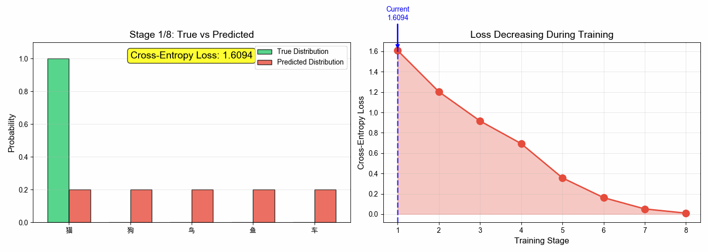
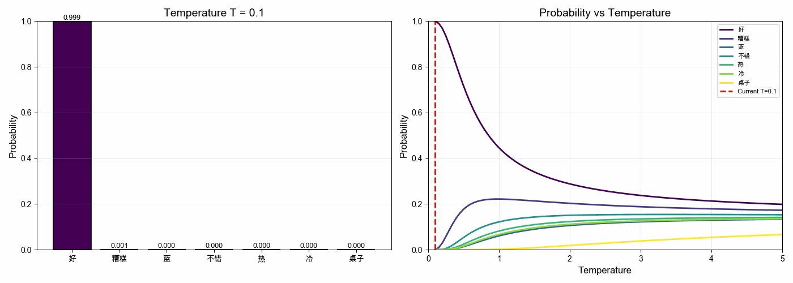

<!-- _class: lead -->

# AI 扫盲课 · 深化版

## 第1课：概率与语言模型

> AI 为什么“会说话”，先从“猜下一个 token”讲起

---

## 课程地图

本课位置：10 课主线的起点

- 第1课：概率与语言模型
- 第2课：Tokenizer 与向量表示
- 第3课：注意力与 Transformer

---

## 今日问题

**AI 为什么能接话？它是真的“懂了”，还是在做别的事？**

先看一句最简单的话：

> 今天天气很 ___

你脑子里会自然冒出几个候选：

- 好
- 热
- 冷
- 差

这已经是一个概率分布了。

---

## 核心直觉

### 语言模型的工作方式

AI 生成文本，本质上是在重复做同一件事：

1. 看见前面的上下文
2. 给下一个 token 打分
3. 把分数变成概率
4. 采样或选择一个 token
5. 继续下一步

一句话总结：

> 语言模型不是先想完整答案再写出来，而是一边生成一边做概率决策。

---

## 一个最小例子

### “我爱吃”

当上下文是 `我爱吃` 时，模型可能给出这样的候选：

| 候选 token | 分数 | 概率 |
|---|---:|---:|
| 苹果 | 4.2 | 52% |
| 火锅 | 3.1 | 18% |
| 月亮 | -2.0 | 接近 0 |

模型并不知道“苹果真的存在于面前”，它只知道：

- 在大量语料里，`我爱吃` 后面接 `苹果/火锅` 很常见
- 接 `月亮` 很不常见

---

## 从分数到概率

### Softmax

模型内部先给每个候选 token 一个分数，叫 `logit`。

Softmax 把一串任意分数变成总和为 1 的概率：

$$P(x_i) = \frac{e^{z_i}}{\sum_j e^{z_j}}$$

它解决了两个问题：

- 谁更可能
- 各自可能性有多大

---

## 为什么训练时要用交叉熵

### 目标不是“像人话”，而是“把正确 token 的概率拉高”

如果真实下一个 token 是 `苹果`，那训练就会惩罚这种情况：

- `苹果` 概率太低
- 错误候选概率太高

常见写法：

$$\mathcal{L} = - \sum_{t=1}^{N}\log P(w_t \mid w_{<t})$$

- 猜得越准，损失越小
- 猜错得越离谱，损失越大

---

## 为什么训练时要用交叉熵

---

## 温度参数

### 为什么同一个模型有时保守，有时发散

采样时常见一个参数：`Temperature`

- `T < 1`：分布更尖，更保守
- `T = 1`：默认
- `T > 1`：分布更平，更发散

可以把它理解成：

> 温度不是让模型“更聪明”，而是改变它在高概率候选和低概率候选之间的探索力度。

---

## 温度参数

---

## 训练和推理不是一回事

**训练阶段**：

- 看海量文本
- 反复猜下一个 token
- 用损失函数更新参数

**推理阶段**：

- 不再更新参数
- 只根据当前上下文做下一步预测

所以：

> 训练是在“塑造分布”，推理是在“使用分布”。

---

## 语言模型会“理解”吗

更严谨的说法应该是：

- 它确实学到了大量语言规律和世界模式
- 但它最直接的训练目标仍然是 next-token prediction
- “理解”这个词在工程上常常有用，在哲学上则没那么简单

抓住底线：

> 只要记住“语言模型首先是概率模型”，后面很多现象就都能串起来。

---

## 本节主线回收

今天先建立 4 个底层概念：

1. 语言模型靠 next-token prediction 工作
2. Softmax 把分数变成概率
3. 交叉熵用来训练“正确 token 概率更高”
4. 温度参数影响输出风格，不改变模型本质

---

## 本节小结

> 第1课只做一件事：建立“AI 本质上是在做概率预测”的认知。

- AI 会说话，不是因为先有完整想法，而是因为会连续做 token 概率预测
- 训练目标决定了它擅长“生成合理续写”
- 这也解释了它为什么可能流畅、却不一定总是正确

---

## 下节预告

### 第2课：Tokenizer 与向量表示

下一步要回答的是：

**人类的文字，究竟怎样变成模型可以处理的输入？**

会讲到：

- Tokenizer / BPE
- Embedding
- 语义空间
- Position Encoding

---

<!-- _class: lead -->

## 谢谢！

**Q&A 时间**

第1课：概率与语言模型
