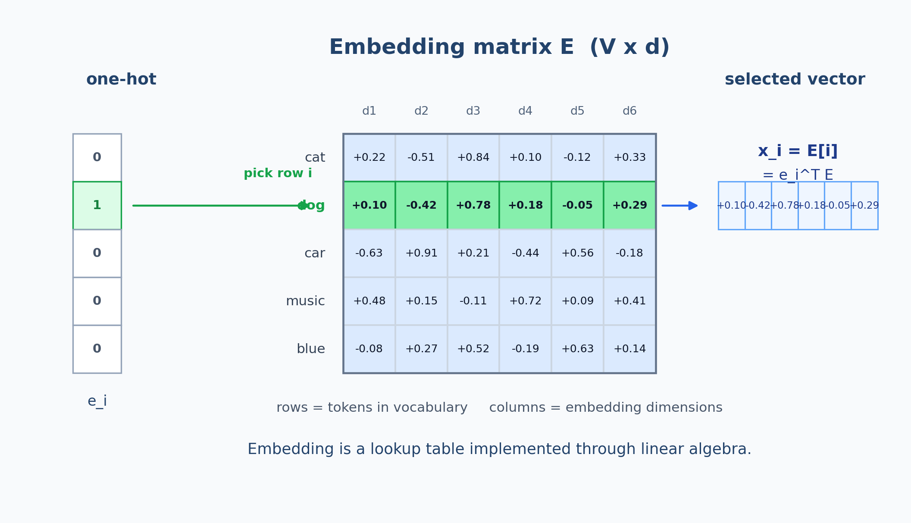
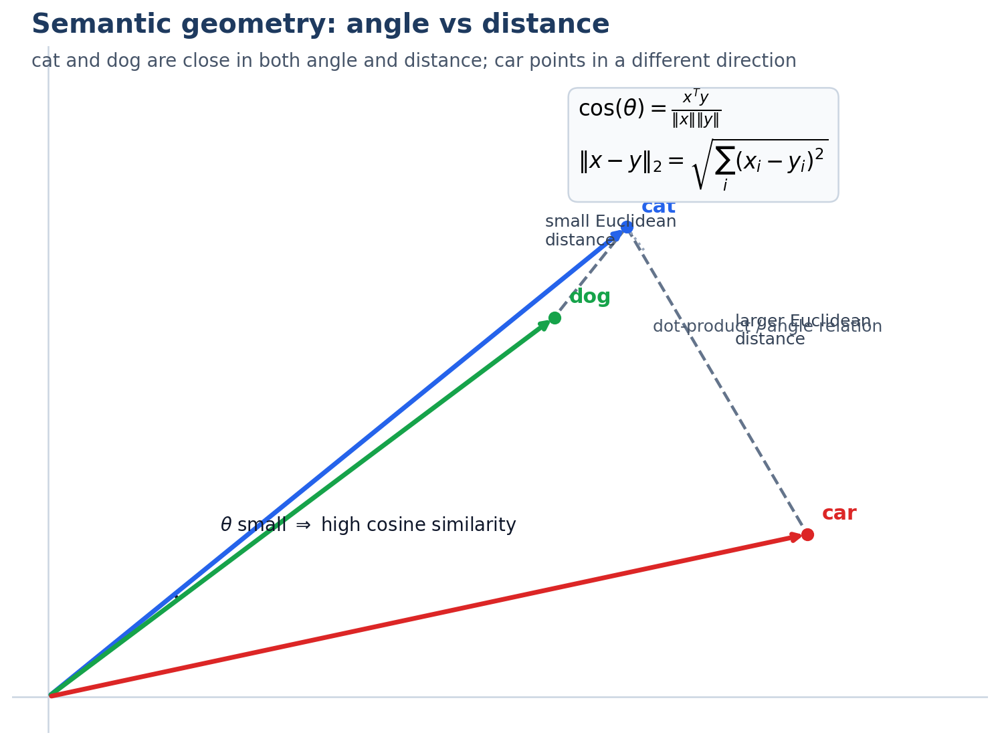

<!-- _class: lead -->

# 小白AI课

## 第2课：从文本到 Transformer 输入

> 文本如何变成 token 序列、表示矩阵，并第一次进入注意力

---

## 课程地图

<div class="map-box">

已学：

- 第1课：概率与语言模型

本课：

- 第2课：从文本到 Transformer 输入

下节：

- 第3课：Transformer 机制与 KV Cache

</div>

---

## 上节回顾

上节我们建立了一个底线：

> 模型本质上是在预测下一个 token。

但还有一个更完整的问题没讲：

**文本到底是怎么变成 Transformer 能处理的矩阵输入的？**

---

## 本节主线

今天把这条链补完整：

1. 先看 Transformer 在处理什么
2. 再看 attention 到底想解决什么
3. 文本如何被切成 token 并映射成矩阵
4. 位置编码如何让顺序进入计算
5. 最后把这些表示送进注意力

---

## 先看全景：Transformer 在吃什么输入

<div class="columns">
<div>

<center>
  
</center>

</div>
<div>

可以先把大模型的一次前向传播理解成：

- 文本先被切成 token ids
- token ids 变成表示矩阵
- 再加上位置矩阵
- 然后进入一层层 Transformer block

目前业界最常见的核心直觉是 Decoder-Only。

所以本课的问题可以压缩成一句话：

> 原始文字，究竟怎么变成 Transformer 里的输入矩阵？

</div>
</div>

---

## 为什么需要 Tokenizer

如果把每个完整词语都当成一个独立单位，会遇到两个问题：

- 词汇表会爆炸
- 新词永远在出现

所以主流做法不是“按词死切”，而是：

> 用有限的子词单元，去组合无限的文本。

---

## 一个 BPE 直觉例子

从字符开始：

```text
low
lower
lowest
```

统计最常一起出现的片段，不断合并：

- `l + o -> lo`
- `lo + w -> low`
- `e + r -> er`

最后：高频片段作为独立 token，低频词保留可拆分能力

---

## Tokenizer 解决了什么

它同时平衡了三件事：

- **表达能力**：常见词语不要拆得太碎
- **泛化能力**：没见过的新词也能拼出来
- **成本控制**：词表不能无限大

这也是为什么：

- 英文往往一个词对应 1 到多个 token
- 中文很多时候一个字就是一个 token 单元

---

## token id 还不够

### 模型不能直接理解整数编号

假设：

- `猫 -> 1729`
- `狗 -> 3141`

这些编号只是索引，没有语义。

真正进入模型之前，还要经过一步：

> 把 token id 查表映射成连续向量，这一步叫 Embedding。

---

## Embedding 是什么

### 把离散符号映射到连续空间

例如：

```text
"猫"   -> [0.2, -0.5, 0.8, ...]
"狗"   -> [0.1, -0.4, 0.7, ...]
"汽车" -> [-0.6, 0.9, 0.2, ...]
```

Embedding 层的价值在于：

- 让模型可以做连续计算
- 让相似概念有机会在空间里靠近

---

## Embedding 的矩阵视角

<div class="columns">

<div>

<center>
  
</center>

</div>

<div>

如果词表大小是 $V$，向量维度是 $d$，那 Embedding 层本质上就是一个矩阵
$E \in \mathbb{R}^{V \times d}$。

本质上：输入 one-hot 向量 $e_i$，就是从矩阵里选出第 $i$ 行，所以

$$x_i = e_i^T E = E[i]$$

这说明 Embedding 不是魔法，而是“查表 + 线性代数”。

</div>

</div>

---

## Embedding 更深一层：它是离散符号的坐标化

从研究味的角度看，embedding 做的不是“给词贴数字标签”，而是：

> 把离散符号嵌入到一个可微的连续几何空间里。

一旦进入这个空间，模型就可以使用**线性变换、范数**等数学工具来表达语义关系。

所以 embedding 的真正价值是：

> 它把“符号问题”转写成了“几何问题”。

---

## 语义空间的直觉

在一个理想化的向量空间里：

- `猫` 和 `狗` 距离更近
- `猫` 和 `汽车` 距离更远

工程上常用余弦相似度衡量方向接近程度：

$$\cos(\theta) = \frac{x \cdot y}{\|x\|\|y\|}$$

所以“语义相似”通常不是字面长得像，而是向量方向更接近。

---

## 语义空间里，角度和距离怎么看

<div class="columns">
<div>

<center>
  
</center>

</div>
<div>

图里 `cat` 和 `dog` 既方向接近也距离较近；`car` 的方向分离更明显，所以余弦相似度更低。

</div>

</div>

---

## 只有词义还不够

### 顺序也必须编码进去

这两句话的 token 几乎一样：

- 我打你
- 你打我

如果模型只看 token 集合、不看顺序，它会把两句话当得太像。

因此需要位置信息。

---

## Position Encoding 的作用

位置编码不是“新词义”，而是给每个 token 一个“坐标”。

它解决的是：

- 谁在前
- 谁在后
- 相对距离有多远

---

## 从矩阵视角看，为什么必须有位置编码

把一句长度为 $n$ 的序列写成矩阵：

$$
X=
\begin{bmatrix}
x_1^T\\
x_2^T\\
\vdots\\
x_n^T
\end{bmatrix}
\in \mathbb{R}^{n\times d}
$$

这里每一行是一个 token 的 embedding。

---

## 从矩阵视角看，为什么必须有位置编码

如果把序列重新排列成 $\Pi X$，其中 $\Pi$ 是一个置换矩阵，那么没有位置编码时，很多计算只是把行和列一起重排。

更直接地说：

> 没有位置编码，模型看到的是“有哪些词在一起”，而不是“这些词按什么顺序排在一起”（顺序对称性）。

**举个例子**：
- 输入“你打我”，如果模型的输出是“我很生气”
- 那么输入“我打你”，只会输出“气生很我”
- 由位置带来的语义信息被严重丢失了


---

## 位置编码本质上是在打破这种对称性

$$\tilde X = X + P,\qquad P\in\mathbb{R}^{n\times d}$$

于是模型内部会出现四类相互作用：

- 内容-内容：这个词和那个词语义像不像
- 内容-位置：这个词出现在这个位置时意味着什么
- 位置-内容：某个位置更该关注什么内容
- 位置-位置：两个位置之间的距离和结构关系

所以位置编码真正提供的，不只是“编号”，而是：

> 给序列矩阵加上一个坐标系，让注意力能同时建模“内容”和“排列结构”。

---

## 序列矩阵终于可以进入 attention

到这一步，真正送进 Transformer 的已经不是“词”，而是带位置的表示矩阵：

$$\tilde X = X + P$$

注意力层要解决的核心任务是：

- 回头看前文
- 找到相关 token
- 汇总最有用的信息

> 小明把苹果给小华，因为它很甜。

读到 `它` 时，人类会自然联想到 `苹果`。

---

## Self-Attention 的一次矩阵计算

$$\text{Attention}(Q, K, V) = \text{softmax}\left(\frac{QK^T}{\sqrt{d_k}}\right)V$$

- $QK^T$ 先算“谁和谁相关”
- `softmax` 把相关性变成权重
- 再用这些权重去加权汇总 $V$

所以注意力做的事可以概括成：

> 对整段序列做一次“按相关性加权的信息汇总”。

---

## Q / K / V 的大白话解释

可以先把它理解成三句话：

- `Query`：我现在在找什么
- `Key`：我这里有哪些线索
- `Value`：如果你关注我，我真正提供什么内容

当当前 token 的 `Query` 和某个历史 token 的 `Key` 更匹配时，对应的 `Value` 权重就更高。

---

## attention 可视化直觉

<center>
  
</center>

热力图里的每一行，都可以理解成：

> 当前这个位置，正在把注意力分配给整段序列里的哪些位置。

---

## Tokenizer 其实也在塑造几何

一个更少在入门课里强调、但很重要的点是：

- token 切分方式会直接决定 embedding 的基本单元
- 基本单元不同，几何空间的组织方式也会不同

例如：

- 中文按字切和按词切，空间结构会差很多
- 代码、数学、自然语言混合时，子词粒度会强烈影响表示质量

所以 tokenizer 不只是工程预处理，它其实在决定：

> 模型最终是用什么粒度来构造自己的语义几何。

---

## 把整条链串起来

### 文本进入模型的流程

```text
原始文本
-> Tokenizer 切分
-> token ids
-> Embedding 矩阵 X
-> 加上位置矩阵 P
-> 得到 X + P
-> 进入 Attention / Transformer Block
```

到这一步，我们才真正解释了：

**模型在“猜下一个 token”之前，看到的到底是什么。**

---

## 本节小结

> 第2课讲的是“原始文本 -> Transformer 输入”的完整链条。

- Tokenizer 解决切分和词表规模问题
- Embedding 让 token 进入连续向量空间
- 语义空间让“相似概念彼此靠近”
- Position Encoding 让模型知道顺序和位置
- Attention 让这份序列表示第一次开始利用上下文

---

## 下节预告

### 第3课：Transformer 机制与 KV Cache

现在我们已经把输入送进了 Transformer。

下一步要回答：

**Transformer block 内部到底是怎么工作的，推理时又为什么会越来越慢？**

会讲到：

- Multi-Head Attention
- Residual / LayerNorm / MLP
- Causal Mask
- KV Cache

---

<!-- _class: lead -->

## 谢谢！

**Q&A 时间**

第2课：从文本到 Transformer 输入
