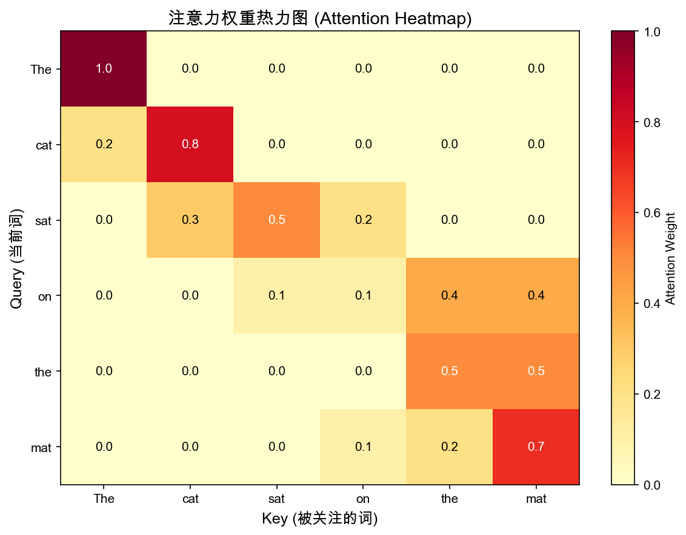
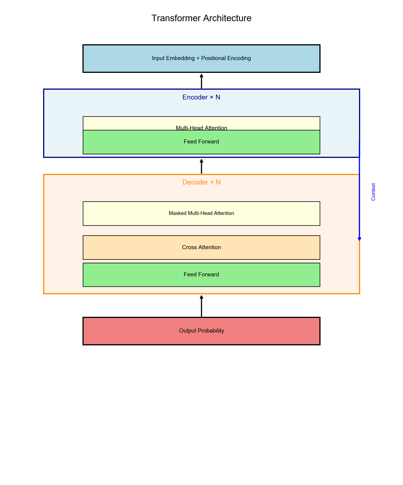
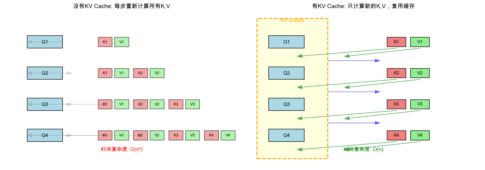

<!-- _class: lead -->

# AI 扫盲课 · 深化版

## 第3课：注意力与 Transformer

> 模型如何利用上下文，而不是只会机械续写

---

## 课程地图

已学：

- 第1课：概率与语言模型
- 第2课：Tokenizer 与向量表示

本课：

- 第3课：注意力与 Transformer

下节：

- 第4课：预训练、规模化与能力提升

---

## 上节回顾

我们已经知道：

- 文本会先被切成 token
- token 会变成向量
- 位置也会被编码进去

现在还差最关键的一步：

**模型怎么决定当前这个 token 应该看谁？**

---

## 一个典型例子

> 小明把苹果给小华，因为它很甜。

读到 `它` 时，人类会自然联想到 `苹果`。

这说明理解不是只看当前词，而是要：

- 回头看前文
- 给相关词更高权重

这就是注意力机制的直觉。

---

## Q / K / V 的大白话解释

### Query / Key / Value

可以把它理解成三句话：

- `Query`：我现在在找什么
- `Key`：我这里有哪些线索
- `Value`：如果我被关注，我真正提供什么内容

当 `Query` 和某个 `Key` 更匹配时，对应的 `Value` 权重就更高。

---

## Self-Attention 公式

$$\text{Attention}(Q, K, V) = \text{softmax}\left(\frac{QK^T}{\sqrt{d_k}}\right)V$$

扫盲版理解：

1. `QK^T` 先算相关性分数
2. `softmax` 把分数变成权重
3. 用权重对 `V` 做加权求和

除以 $\sqrt{d_k}$ 的作用是避免分数过大，导致 softmax 过于极端。

---

## 为什么 Multi-Head 有用

一个头只能看到一种“相关性”。

多个头可以并行学不同关系：

- 指代关系
- 语法关系
- 时间关系
- 长距离依赖

所以它不是简单重复，而是：

> 用多个视角同时看上下文。

---

## Transformer 做了什么

把注意力机制组织成一个可堆叠的大系统：

- Multi-Head Attention
- Feed Forward
- Residual / LayerNorm
- 多层堆叠

这使得模型可以逐层形成更抽象的表示。

---

## Transformer 架构图

常见三类用法：

- Encoder-Only：理解任务，如 BERT
- Decoder-Only：生成任务，如 GPT
- Encoder-Decoder：输入输出结构明显的任务，如翻译

扫盲课主线里，后续默认以 Decoder-Only LLM 为核心直觉。

---

## 为什么推理会越来越慢

如果每生成一个新 token，都把前面所有 token 重新算一遍，成本很高。

这就引出一个工程优化：

### KV Cache

- 历史 token 的 `K/V` 缓存起来
- 新 token 到来时直接复用历史结果

---

## KV Cache 直观图

一句话理解：

> 训练强调并行，推理强调复用。

---

## 本节小结

> 第3课讲的是“模型如何利用上下文”。

- 注意力机制让模型不再只会机械按顺序扫过去
- Q / K / V 提供了“查找线索 -> 汇总信息”的计算框架
- Transformer 把注意力扩展成现代大模型的基础架构
- KV Cache 解释了推理优化的一个关键直觉

---

## 下节预告

### 第4课：预训练、规模化与能力提升

到这里为止，我们知道模型怎么“计算”了。

下一步要讲：

**它为什么越训越强、越大越能做事？**

会讲到：

- Pre-training
- Scaling Law
- Chinchilla
- In-context Learning
- Emergence

---

<!-- _class: lead -->

## 谢谢！

**Q&A 时间**

第3课：注意力与 Transformer
