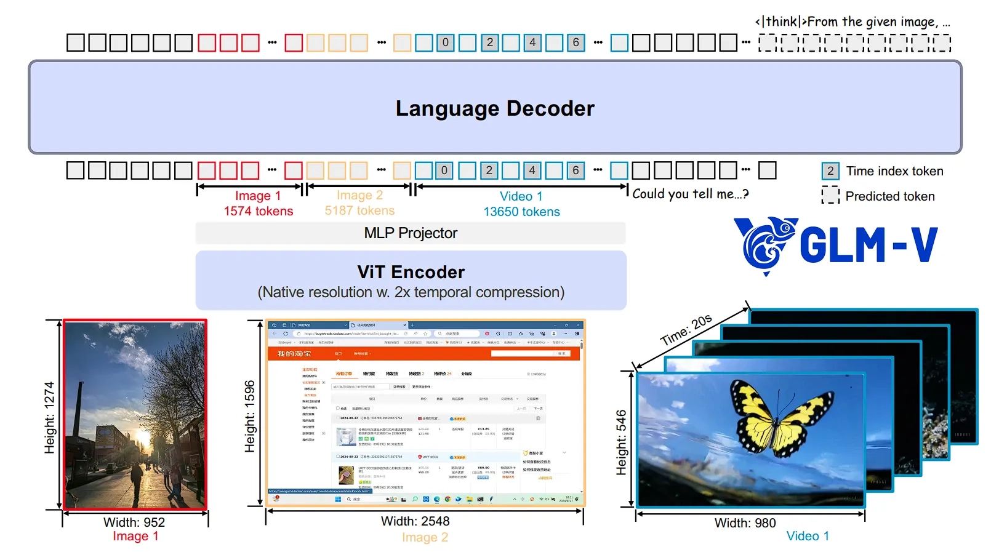

<!-- _class: lead -->

# AI 扫盲课 · 深化版

## 第9课：多模态理解基础

> 把“能看懂”单独讲，不和“会生成图像”混在一起

---

## 课程地图

已学：

- 第8课：偏好学习与强化学习后训练

本课：

- 第9课：多模态理解基础

下节：

- 第10课：图像生成基础

---

## 上节回顾

前 8 课默认模型的主输入是文本。

现在扩展一个自然问题：

**如果输入变成图片、文档、截图，模型为什么还能工作？**

---

## 什么叫多模态

模态就是信息的表现形式，例如：

- 文本
- 图像
- 音频
- 视频

多模态理解要解决的核心不是“生成”，而是：

> 把不同模态都变成可比较、可融合的表示。

---

## 表示空间才是关键

回忆第 2 课：

- 文本 token 会变成向量

多模态里，图像也要被变成向量。

真正难点在于：

- 文本向量空间和图像向量空间，怎么对齐
- “一只猫”这句话，怎么和猫的图片靠近

---

## CLIP 的核心直觉

### Contrastive Language-Image Pre-Training

训练时拿图文配对样本：

- 匹配的图文拉近
- 不匹配的图文拉远

于是模型慢慢学会：

- 什么图片和什么文字是对应的
- 图文可以进入一个共享表示空间

---

## 从 CLIP 到多模态大模型

很多多模态系统都可以粗略拆成三段：

1. 视觉编码器：把图像变向量
2. 连接模块 / Adapter：把视觉表示接到语言模型接口上
3. LLM：负责理解任务和生成文本答案

---

## 一个典型结构图

这也是为什么多模态模型常被描述成：

> 视觉编码器 + 连接器 + LLM

---

## 多模态理解能做什么

典型能力包括：

- 图像描述
- 看图问答（VQA）
- OCR 与文档理解
- 图文检索
- 表格和票据解析

这些任务的共同点是：

> 重点是“看懂”和“回答”，不是直接“生成图像”。

---

## 多模态理解的局限

常见短板包括：

- 视觉细节漏看
- 空间关系理解弱
- 小字、表格、复杂页面易出错
- 看得懂局部，不一定能做高质量跨页推理

所以实际落地时，文档切图、OCR 预处理、检索增强仍然很重要。

---

## 本节小结

> 第9课讲的是“模型如何理解多种输入”。

- 多模态理解的核心是表示对齐
- CLIP 提供了图文对齐的经典直觉
- 典型 MLLM 架构是视觉编码器 + Adapter + LLM
- 看图问答、OCR、文档理解都属于“理解”路线

---

## 下节预告

### 第10课：图像生成基础

最后一节专门回答另一个完全不同的问题：

**模型为什么能画图，而且这件事为什么不能直接套用 next-token prediction 的直觉？**

---

<!-- _class: lead -->

## 谢谢！

**Q&A 时间**

第9课：多模态理解基础

